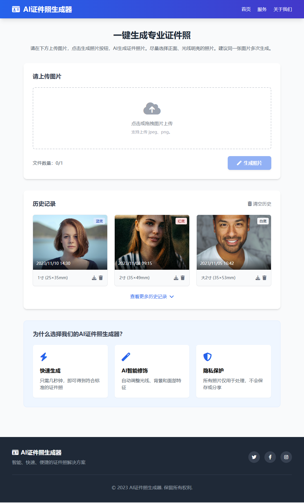

# AI 证件照生成器

## 项目简介

AI 证件照生成器是一个基于人工智能技术的在线工具，可以一键将用户普通照片转换成符合标准规格的各种证件照。无需专业摄影设备或后期处理技能，用户只需上传照片，即可获得专业品质的证件照。

## 主要功能

-   **智能照片处理**：AI 自动处理面部光线，消除阴影，调整表情
-   **多种背景颜色**：支持蓝底、红底、白底和黑底证件照
-   **多种尺寸规格**：支持 1 寸、2 寸和大 2 寸等多种国标证件照规格
-   **高品质输出**：照片输出达到 300DPI 的专业打印质量
-   **实时预览比较**：原图与处理后的照片对比，直观查看效果
-   **历史记录管理**：保存生成的证件照，方便后续下载和使用

## 使用方法

1. **上传照片**：点击上传区域或拖拽照片到指定区域，支持 JPEG、PNG 格式
2. **点击生成**：系统自动分析并处理照片，生成标准证件照
3. **选择选项**：可选择不同背景颜色和照片尺寸
4. **下载照片**：选择满意的效果后直接下载，可用于证件申请、简历等

## 技术特点

-   **智能人像分割**：精确分离人像与背景
-   **面部优化算法**：自动校正光线、阴影和表情
-   **专业色彩管理**：确保肤色自然还原
-   **精确尺寸裁剪**：严格遵循各类证件照标准规格

## 适用场景

-   身份证、护照等官方证件照片
-   学生证、工作证等机构证件照
-   简历、求职材料用照片
-   各类在线申请表格的证件照

## 使用提示

-   上传正面、光线明亮的照片效果最佳
-   建议同一张图片多次生成，选择最佳效果
-   选择不同背景色可适应不同场景需求
-   注意查看预览效果，确保面部表情自然

## 隐私保障

-   用户上传的照片仅用于当前处理，不会被永久存储
-   所有照片处理过程均在用户本地完成，保障数据安全
-   历史记录功能可随时清除

## 未来计划

-   支持更多证件照国际标准
-   增加证件照集合打印功能
-   优化移动端使用体验
-   开发批量处理功能
